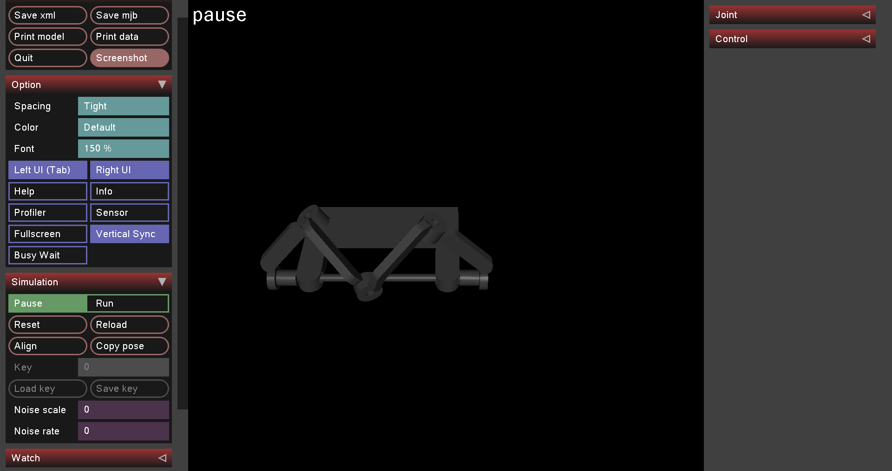

# Robotics Modeling, Simulation & Prototyping

Undergraduate robotics coursework by **Askar Akhmetkhanov** at **Innopolis University**, covering robot modeling, inverse dynamics, CAD-to-simulation workflows, and hardware prototyping.

The repository brings together MuJoCo models of serial and parallel mechanisms, a Python experiment for joint torque analysis, URDF exports with a PyBullet simulation example, and PCB manufacturing files.

**Tools:** Python · MuJoCo · PyBullet · NumPy · pandas · Matplotlib · Seaborn · CAD · URDF/MJCF · PCB design · FlatCAM

## Project overview

| Area | Work included | Main files |
| --- | --- | --- |
| Serial robotic arm | Four revolute joints: shoulder pitch, shoulder roll, shoulder yaw, and elbow pitch | [`model1.xml`](model1.xml) |
| Parallel linkage | Four-bar mechanism coursework model with a loop-closing equality constraint | [`model2.xml`](model2.xml) |
| Static inverse dynamics | Joint configuration sampling, torque calculation, CSV export, and violin plots | [`script.py`](script.py) |
| CAD and robot descriptions | CAD screenshots and robot exports in URDF and MuJoCo XML formats | [`cad design hw/`](cad%20design%20hw/) |
| Final mechanism model | Mesh-based mechanism, URDF/MJCF descriptions, and a PyBullet example | [`Final/`](Final/) |
| PCB design and fabrication preparation | Schematic, board previews, Gerber/Excellon files, DXF, milling/drilling G-code, and photographs | [`PCB homework/`](PCB%20homework/) |
| 3D printing | Photograph of the course test part | [`3d printing.jpg`](3d%20printing.jpg) |

## Modeling and experiments

### Serial robotic arm

[`model1.xml`](model1.xml) represents an arm with three shoulder joints and one elbow joint, connecting links, and an end effector. Each joint has a motor actuator. The model defines geometry, masses, joint axes, gravity, and a shoulder-roll joint limit.

This model is the input to the static inverse-dynamics experiment.

### Static joint torque analysis

[`script.py`](script.py) uses the MuJoCo Python API to:

1. Sample 10 angles per joint, using the configured joint limits or a range of `[-π, π]` for unlimited joints.
2. Evaluate the Cartesian product of those samples: **10,000 configurations** for the four-joint arm.
3. Set joint velocities and accelerations to zero and call `mujoco.mj_inverse` to calculate the corresponding generalized joint forces.
4. Export joint names, angles, and torques to `data.csv`.
5. Display a violin plot comparing torque distributions across joints.

The CSV contains one row per joint per sampled configuration, giving **40,000 rows** for the current model:

| Column | Meaning | Unit |
| --- | --- | --- |
| `joint` | Joint name from the model | — |
| `angle` | Sampled joint angle | rad |
| `torque` | Inverse-dynamics torque for that joint | N·m |

The script samples a discrete grid of configurations. Contact handling follows the model's collision settings; the script does not explicitly disable collisions. Results should therefore be interpreted as outputs of the current simulation model, rather than measured motor loads.

### Parallel mechanisms and CAD exports

[`model2.xml`](model2.xml) explores a closed linkage using a MuJoCo `connect` equality constraint.

The [`Final/`](Final/) directory contains a CAD-derived mechanism with STL meshes, a URDF description, and a MuJoCo model. In [`arc_model.xml`](Final/arc_model.xml), a `connect` equality constraint joins the two branches of the mechanism. The [`hello_bullet.py`](Final/hello_bullet.py) example loads the URDF in PyBullet and advances the simulation under gravity.



*MuJoCo view of the final mechanism model.*

The earlier [`cad design hw/`](cad%20design%20hw/) directory contains another set of CAD screenshots and URDF/XML exports. Its referenced mesh files are not included in that directory; the final model has its mesh assets under [`Final/meshes/`](Final/meshes/).

### PCB design and 3D printing

The PCB coursework focused on a board for distributing power to two motors and connecting a CANable interface. The [`PCB homework/`](PCB%20homework/) directory documents the design and fabrication preparation through:

- An electrical schematic and 3D board previews.
- Gerber layers and Excellon drill files.
- A DXF board export.
- FlatCAM-generated G-code for isolation milling and drilling.
- Photographs from the PCB work.

A separate [3D-printing photograph](3d%20printing.jpg) documents the course test part.

## Getting started

### Set up a Python environment

Clone the repository and create an isolated environment. The commands below use a macOS/Linux shell:

```bash
git clone https://github.com/AskArtwentythree/IPhomework1.git
cd IPhomework1
python3 -m venv .venv
source .venv/bin/activate
python -m pip install mujoco numpy pandas matplotlib seaborn pybullet
```

On Windows, create the environment with `py -m venv .venv` and activate it in PowerShell with `.venv\Scripts\Activate.ps1`.

The repository does not pin dependency versions. Interactive viewers and plot windows require a graphical desktop environment.

### Run the static torque experiment

Run from the repository root so the script can find `model1.xml`:

```bash
python script.py
```

This writes `data.csv` in the current directory and opens the joint torque violin plot. A subsequent run overwrites the CSV. The plot is displayed rather than saved automatically.

### Inspect the MuJoCo models

From the repository root, launch one model at a time:

```bash
python -m mujoco.viewer --mjcf=model1.xml
```

```bash
python -m mujoco.viewer --mjcf=model2.xml
```

```bash
python -m mujoco.viewer --mjcf=Final/arc_model.xml
```

See the [MuJoCo Python viewer documentation](https://mujoco.readthedocs.io/en/stable/python.html#standalone-app) for viewer usage.

### Run the PyBullet example

From the repository root:

```bash
cd Final
python hello_bullet.py
```

The script opens the PyBullet GUI, loads `Final.urdf` and a ground plane, steps the simulation 10,000 times, and prints the final base pose. Run it from `Final/` because the URDF path is relative to the working directory.

The PyBullet example loads the exported joint tree; it does not recreate the loop-closing constraint defined in the MuJoCo XML. These two examples therefore use different constraint setups.

## Skills practiced

- Representing robot geometry, joint axes, inertial properties, and actuators in simulation.
- Modeling serial chains and closed linkages.
- Automating numerical experiments and analyzing joint torque distributions in Python.
- Working with CAD exports, STL meshes, URDF, and MuJoCo XML.
- Preparing PCB design files and machining toolpaths.
- Documenting mechanical and electronic prototyping work.

## Author

**Askar Akhmetkhanov**  
[GitHub](https://github.com/AskArtwentythree) · [LinkedIn](https://www.linkedin.com/in/askar-akhmetkhanov/)

